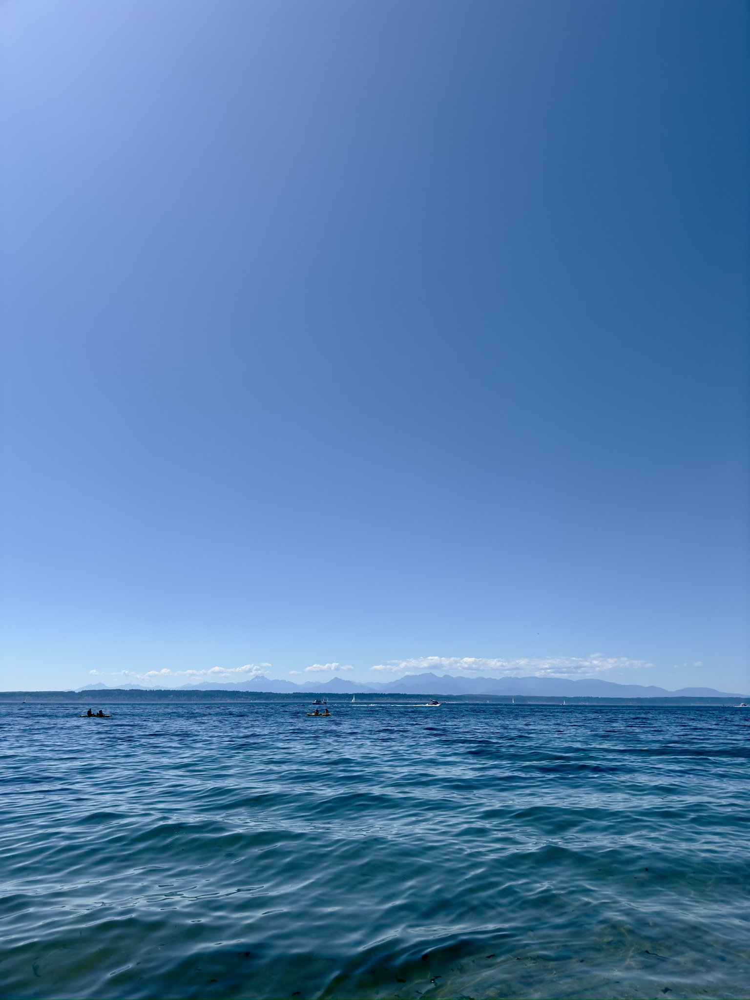

# Milena's Portfolio

## About Me

My name is Milena Sanchez and I am a senior at MIT taking 6.1040 this fall!

Some fun facts about me:

1. I love baking, trying new recipes, and sharing my creations.
2. During my free time, I like to play volleyball.
3. I like photography and am looking to improve!

## Semester Objectives

This semester I hope to be able to develop functional and exciting apps! I am looking forward to learning new skiils and applying them to the work I produce throughout the class :)

## Table of Contents

[Link to Assignment 1](assignments/assignment1.md)

[Link to Assignment 2](assignments/assignment2.md)

[Link to Assignment 3](assignments/assignment3.md)
