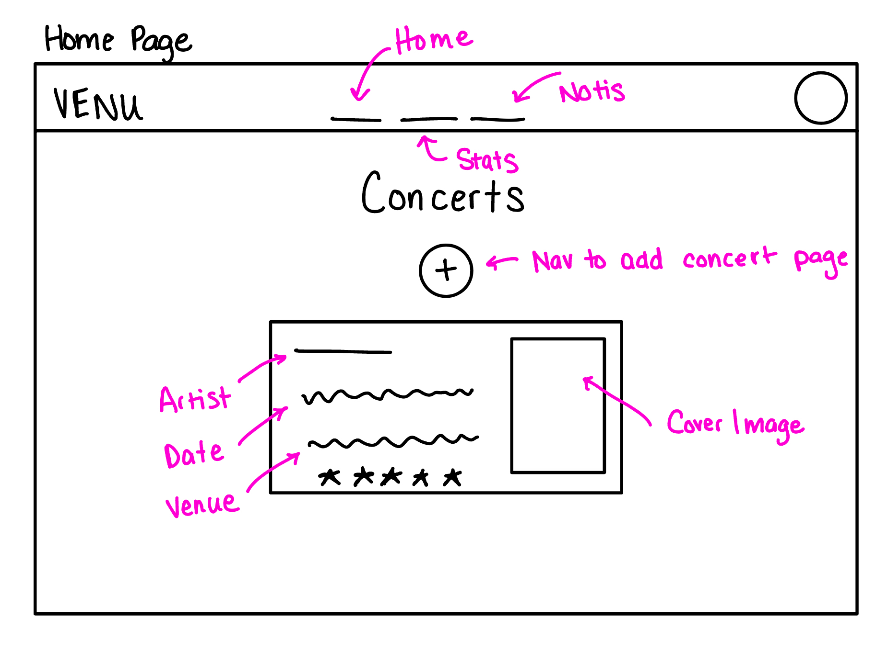
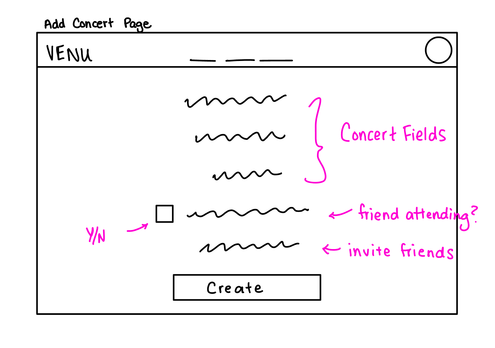
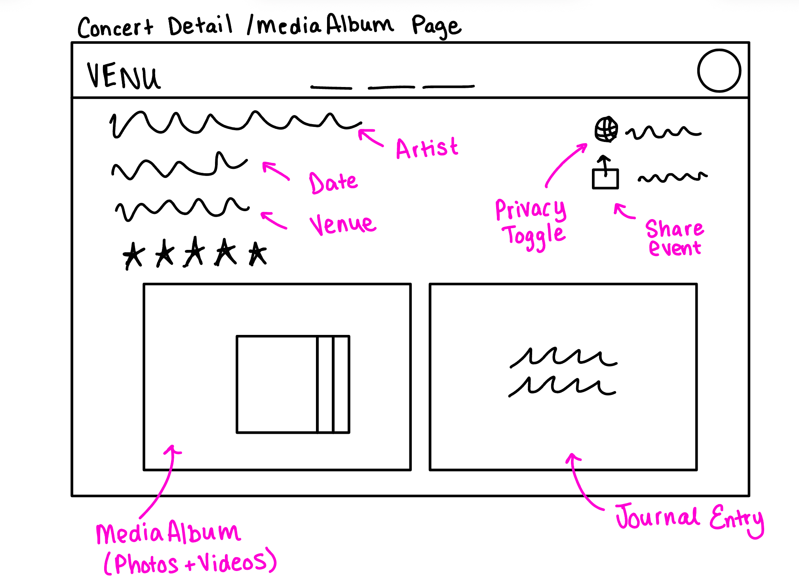
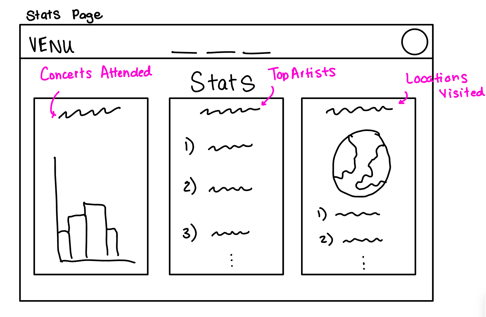
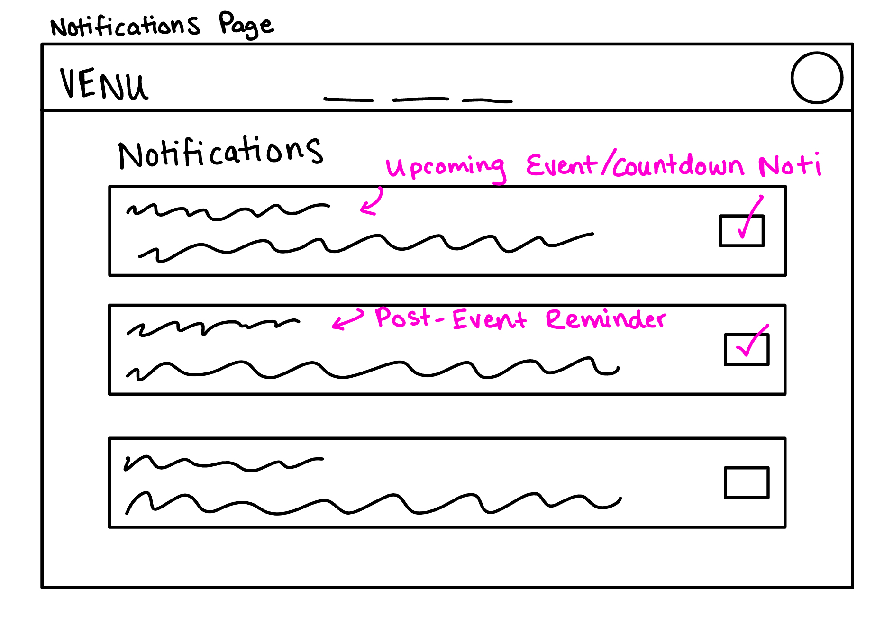
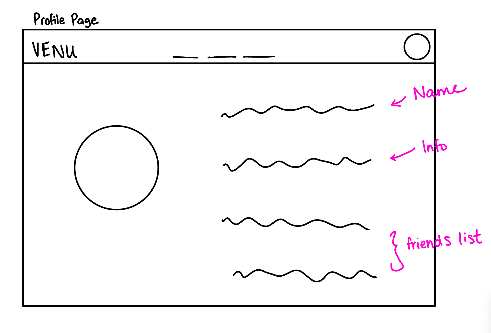

# Functional Design Assignment

## Problem Statement

**Problem Domain**: Concert Memory Organization

Currently, live music events such as concerts have become an integral part of entertainment culture. Millions of people, like myself, attend one or more concerts every year which typically results in nearly every attendee recording photos and videos. These memories, however, often end up scattered across devices and apps. As someone who attends concerts regularly, I’ve personally found it frustrating to later sort through a messy camera roll to find the highlights of a show. This domain is of particular interest to me because concerts are meaningful experiences, and being able to easily relive them makes them more special.

**Problem**: Filtering Concert Memories

Concert fanatics usually capture many photos and videos at events in order to relive the experience after the concert. Sometimes this becomes difficult as revisiting these memories becomes a chore because the content is disorganized and mixed with unrelated media. Current photo apps store memories generically, without tools tailored to concert experiences. Users lack an easy way to collect, categorize, and personalize their concert content to relive these moments in a meaningful way.

**Stakeholders**:

- Concertgoer: Primary user who records and organizes concert footage; experiences frustration when memories are hard to find or scattered.

- Artist: Performers whose shows are being documented; can gain increased fan engagement and shareable content when fans have better tools to manage memories.

- Friends: People who attended the concert with the user or who want to view the user’s memories; benefit from consolidated shared footage.

**Evidence and Comparables**:

- [Around 151 million people worldwide attended nearly 550,00 Live Nation events, which marked a 4% year-over-year (YoY) increase](http://imusician.pro/en/resources/blog/live-music-industry-in-2025): Article that explains the recent booming and demand of live events including a 4% YoY increase in 2024.

- [By 2025, users are forecast to take over 2T smartphone photos every year](https://passport-photo.online/blog/mobile-photography-trends-and-stats/?srsltid=AfmBOooDa8rae0EOJ4wxJJQPu_UAwc4utmM4zfDBnN5VN3sQgoK4252A): Article that provides statistics about the common use of mobile devices to capture images. Supports the idea that during an experience, like a concert, it is very likely that digital footage will be captured, giving the platform a purpose.

- [We found that, on average, Americans haven’t looked at 55% of their camera roll in the last year, and they only rarely look back on photos or videos taken a year ago or later](https://www.mixbook.com/inspiration/states-that-phlush-away-memories?srsltid=AfmBOoqY9TM672Gbg8srCwa0IGbzZtwk0wmL3wV25HWZ8VOsI6SHMIS3): A good portion of Americans don't look back on images they may have taken, but this also might be due to the fact that it is not organized, giving the platform a purpose. In a more organized manner, it might be easier and more meaningful for a person to look back and reflect on their concert experience.

- [Google Photos](https://www.google.com/photos/about/): Good for storage of photos and memories, but scrap-book memory suggestion algorithm is generic and mostly random. There is no way to explictly filter concert content out by artist even through search unless by manually hand-picking.

- [iCloud Photos](https://www.icloud.com/photos): Similar to Google Photos, store images and videos, butnot concert-specific. Memories are displayed at random and no way to personalize getting specific memory reminders about only past concerts.

- [bandsintown](https://www.bandsintown.com/): Platform's purpose is to keep track of future events, but no space to store personal memories from events attended.

- [Songkick](https://www.songkick.com/): Platform is good for searching concerts that are of personal interest. Platform is the closest in similarity to the intended goal, but not really personalizable in terms of keeping personal media organized.

- [Five Steps to Turn “The Pile” into Precious Memories](https://thephotomanagers.com/artwork-memorabilia-pile/): Blog post that describes an approach to turning "clutter" into concise memories. Gives suggestions on titling and adjusting the time of images to give them more meaning the way organization of past concerts could become clearer memories to revisit.

- [AI Photo Organizing Software](https://cyme.io/en/blog/best-photo-organizing-software-with-ai/): Describes current approaches being utilized to sort through camera rolls that integrate different platform like Google Photos or iCloud Photos. AI tagging being a possible approach to resolving the issue of losing value in memories due to having a hard time finding certain footage.

- [Best Photo Organizing Software](https://www.digitalcameraworld.com/buying-guides/best-photo-organizing-software): Guide that explores different softwares that currently exist for organization, most of which are paid. Emphasizes the idea that digital organization is in high demand, but no software specifically targets personalized concert experience organization.

## Application Pitch

**Name**: Venu

**Motivation**: Concertgoers want a simple way to revisit concerts, group them by show, and share the highlights with friends without digging through hundreds of unrelated pictures— Venu solves this by turning chaotic camera rolls into organized concert journals.

**Key Features**:

1. **Automatic Concert Detection**

   This feature scans the time, date, and location metadata of a user’s photos and cross-matches it with ticket or calendar info to automatically group media from the same show. It reduces the time fans spend manually sorting through their camera rolls and ensures no moment is lost. For concertgoers it means instant organization; for artists and venues it increases the chance that their shows are correctly tagged and discoverable.

2. **Highlight Reel Generator**

   Venu selects the best clips and photos from an event and stitches them into a short, shareable montage. This solves the common problem of friends never getting around to editing their footage due to endless scrolling through camera rolls. Fans get an easy way to relive the night and share it online, while artists, venues, and sponsors benefit from the published footage.

3. **Friend Collaboration**

   Attendees can invite friends to contribute their photos and videos to a single shared album. This reduces duplication and makes it easier to see the whole night from multiple perspectives without mixing up media from congested camera rolls. Friends and families get a richer collective memory, and artists/venues see increased engagement and reach as multiple attendees share content from the same show.

## Conept Design

### Concepts

**concept** UserAccount

**purpose** represent a registered user and their friend relationships

**principle** after a friend link is added, privacy=Friends includes that user

**state**

a set of Users with

userID ID

name String

a set of friend Users

**actions**

addFriend (u: User, friend: User)

**requires** u not equal to friend and friend not in u.friends

**effect** adds friend to u.friends

 

removeFriend (u: User, friend: User)

**requires** friend in u.friends

**effect** removes friend from u.friends

 

**concept** ConcertEvent[User, Artist]

**purpose** Represents a single concert that a user attended which contains all content, statistics, and notifications related to that event

**principle** After a concert is created, all data and actions related are linked to this object

**state**

a set of ConcertEvents with

concertID ID

an owner User

an artist(s) Artist

date DateTime

venue String

city String

optional ticket/seat info

 

a set of Users with

attendingUser(s) String

**actions**

addConcert (user: User, artist: Artist, date: DateTime, venue: String, city: String): (concert: ConcertEvent)

**requires** no ConcertEvent exists with user, artist, date, venue

**effect** creates and saves a new ConcertEvent with attendingUsers = user

 

inviteFriend (user: User, friend: User, concert: ConcertEvent)

**requires** concert exists and friend not already in concert.attendingUsers

**effect** adds friend to concert.attendingUsers

 

editConcertDetails (concert: ConcertEvent, newArtist: Artist?, newDate: DateTime?, newVenue: String?, newCity: String?)

**requires** concert already exists

**effect** updates the specified fields of the ConcertEvent

 

**concept** MediaAlbum [User, ConcertEvent]

**purpose** Stores and organizes photos and videos for each concert, separate from the user’s general camera roll.

**principle** After an album is created for a user and a concert, every media item uploaded for that concert by that user is placed on that single album. The album’s privacy setting consistently controls access to the media items’ visibility.

**state**

a set of MediaAlbums with

albumID ID

concert ConcertEvent

an owner User

a privacy flag {Private, Friends, Public}

 

a set of mediaItems

a file MediaFile

a timeStamp DateTime

a taggedUsers Set

**actions**

createAlbum (user: User, concert: ConcertEvent): (album: MediaAlbum)

**requires** concert exists and no album exists for (user, concert)

**effect** creates a new MediaAlbum linked to the concert and owned by user

 

uploadMedia (user: User, album: MediaAlbum, file: MediaFile, timestamp: DateTime)

**requires** album.owner = u or
(album.privacy = Public) or
(album.privacy = Friends and u in album.owner.friends)

**effect** adds a new MediaItem to album.mediaItems

 

setPrivacy (album: MediaAlbum, level: {Private, Friends, Public})

**requires** album exists

**effect** sets album.privacy = level

 

tagFriend (album: MediaAlbum, media: MediaItem, friend: User)

**requires** media in album.mediaItems and friend in album.concert.attendingUsers

**effect** adds friend to media.taggedUsers

 

**concept** ConcertStats [User]

**purpose** Provides each user with personalized statistics (concert streaks, artist counts, number of shows attended) and extends journaling structure

**principle** a user’s stats are automatically updated from their concerts to reflect up-to-date experience

**state**

a set of StatsRecord with

a totalConcerts Number

a currentStreak Number

a topArtists List

a journalEntries Set

**actions**

recordJournal (user: User, concert: ConcertEvent, text: String): (entry: JournalEntry)

**requires** concert exists and user in concert.attendingUsers

**effect** creates and saves a new JournalEntry for user linked to the concert

 

generateStats (user: User): (stats: StatsRecord)

**requires** user exists

**effect** computes user’s stats from their ConcertEvents and MediaAlbums and returns updated StatsRecord

 

**concept** Notification [User, ConcertEvent]

**purpose** sends reminders and updates to upload footage after an event
**principle** whenever a concert is added or completed, appropriate reminders are automatically scheduled for that user

**state**

a set of Notifications with

notificationID ID

user User

concert ConcertEvent

a designated trigger {Countdown, PostEventUpload}

a status {Pending, Sent}

an optional daysBefore Number

**actions**

scheduleCountdown (user: User, concert: ConcertEvent, daysBefore: Int): (n: Notification)

**requires** concert exists and daysBefore > 0

**effect** creates a Countdown notification for user to be sent daysBefore concert.date

 

scheduleUploadReminder (user: User, concert: ConcertEvent): (n: Notification)

**requires** concert exists

**effect** creates a PostEventUpload notification for user to be sent after concert.date

 

markSent (n: Notification)

**requires** n.status = Pending

**effect** sets n.status = Sent
 

### Synchronizations

**sync** createAlbum

**when** ConcertEvent.addConcert (user, artist, date, venue, city): (concert)

**then** MediaAlbum.createAlbum (user: user, concert: concert)

 

**sync** scheduleCountdown

**when** ConcertEvent.addConcert (user, artist, date, venue, city): (concert)

**then** Notification.scheduleCountdown (user: user, concert: concert, daysBefore: 3)

 

**sync** updateStats

**when** MediaAlbum.uploadMedia (user, album, file, timestamp)

**then** ConcertStats.generateStats (user: user)

 

**sync** uploadReminder

**when** ConcertEvent.addConcert (user, artist, date, venue, city): (concert)

**then** Notification.scheduleUploadReminder (user: user, concert: concert)

 

**sync** tagFriendNotify

**when** MediaAlbum.tagFriend (album, media, friend)

**then** Notification.scheduleUploadReminder (user: friend, concert: album.concert)

### Brief Note

- ConcertEvent is the central concept, representing each concert attended. All other concepts essentially branch from it.

- MediaAlbum handles the storage and organization of the user’s photos and videos. It’s created per concert automatically and ties directly back to every ConcertEvent.

- ConcertStats aggregates data across all the user’s ConcertEvents and MediaAlbums to show streaks and counts.

- Notification keeps users engaged and reduces the chance they forget to upload or miss an upcoming show. Additionally reminds tagged friends to upload their own footage.

## UI Sketches

## User Journey

After purchasing future concert tickets, the concertgoer (user) uses the app Venu to create a ConcertEvent (see Add Concert Page) in order to establish an automatic countdown notification (see Notifications page) for the upcoming concert date. The user attends the live concert and captures many photos and videos on their phone. By the end of the event, their camera roll contains many media items, often mixed with unrelated content which makes it difficult to locate and revisit the concert experience on demand after the concert. The user again opens Venu on their phone to organize their media. The ConcertEvent now has a corresponding MediaAlbum (see Concert Detail Page) that collects all photos and videos from that concert in one place. Here, the user can choose the privacy settings of the album’s visibility— private, friends, or public.

The user can also invite friends who attended the concert to contribute their media. The collaboration feature (tagged friends component) combines all media into a single album, providing multiple perspectives while keeping the media organized. Tagged friends receive a notification to upload their own media if they choose to. In addition, the user can generate a short clip automatically generated from the best moments from the album ultimately producing a quick, short, shareable montage. This simplifies the process of revisiting and sharing concert highlights without manually sorting through numerous files.

Finally, the user’s ConcertStats (see stats page) are also automatically updated, showing total concerts attended, streaks, favorite artists, and optional linked journal entries (see concert detail page). This helps the user track their concert experiences over time and relive memories in a meaningful, organized way. With Venu, the user’s concert memories are organized and easily accessible. They can relive experiences, share highlights, collaborate with friends, and track their musical journey without the hassle of searching through a cluttered camera roll.
